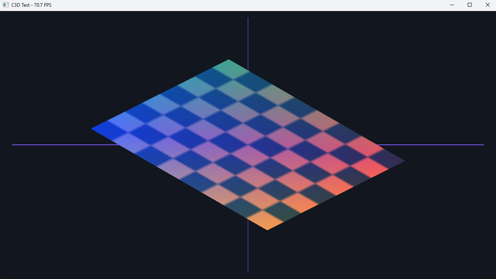
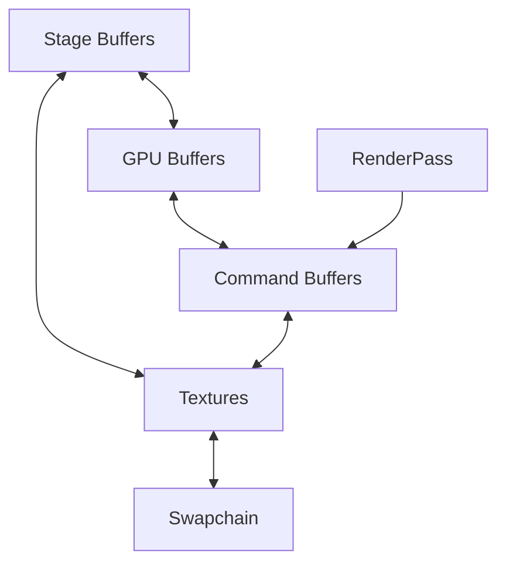
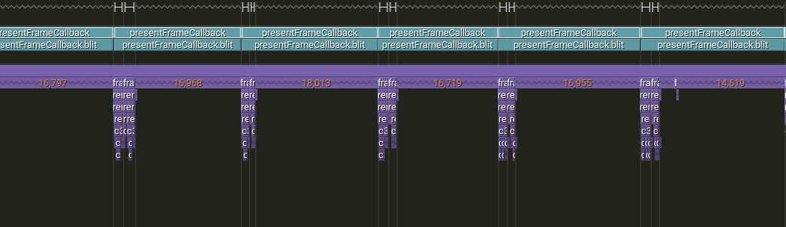

# C3D

C3D is a small graphics API for 2D/3D-style rendering backed by NVIDIA CUDA.
It was built for fun and experimentation, not as a serious production renderer or a replacement for a native graphics API.

It exposes a compact graphics-like interface for:
- stage buffers
- textures
- vertex and index buffers
- command buffers
- render passes
- line, quad, and triangle draws
- swapchain

The repo also includes a Windows demo in `test/main.cpp` that renders into a CUDA texture, copies the result back to the CPU, and presents it with GDI.

## Why I Built This

I built C3D to experiment with a graphics API shape without depending on a full native graphics stack like Direct3D, Vulkan, or OpenGL.

The idea is to keep the public API small and C-friendly, but run the heavy lifting on CUDA.

This project is intentionally lightweight and exploratory. The goal is to learn, prototype, and test ideas, not to chase production readiness.

## Project Layout

- `inc/C3D.h`: public API
- `src/*.cu`: CUDA implementation
- `test/main.cpp`: Windows demo application
- `project.bbs`: build description for the `bbs` build system

## API Overview

The public header is organized around a few resource types plus a minimal command submission model:

## Building

To build the project, install [`bbs`](https://github.com/luppichristian/bbs).

Then run `bbs build` from the repository root.

To build C3D with [Tracy](https://github.com/wolfpld/tracy) integrated through `bbs`, use one of the profiling configs:

`bbs build -t c3d_test -c debug-profile`

or

`bbs build -t c3d_test -c release-profile`

The `debug` and `release` configs build the normal targets without Tracy enabled. The `debug-profile` and `release-profile` configs enable `TRACY_ENABLE` for both the CUDA library and the demo while using the same `c3d_lib` / `c3d_test` targets.

## Current Bottleneck

Right now the main bottleneck is Windows presentation through GDI.

C3D renders into CUDA-managed GPU memory, but the demo cannot present that memory directly to a window surface. Instead, it has to copy the rendered image back to CPU-visible memory and hand it off to GDI for presentation. That extra GPU-to-CPU transfer plus the GDI blit is currently the slowest part of the frame path.

Here is a Tracy capture from the demo showing the presentation path under inspection:

